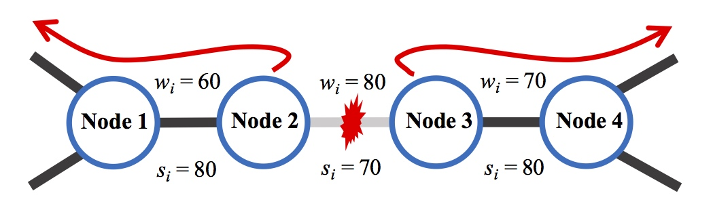
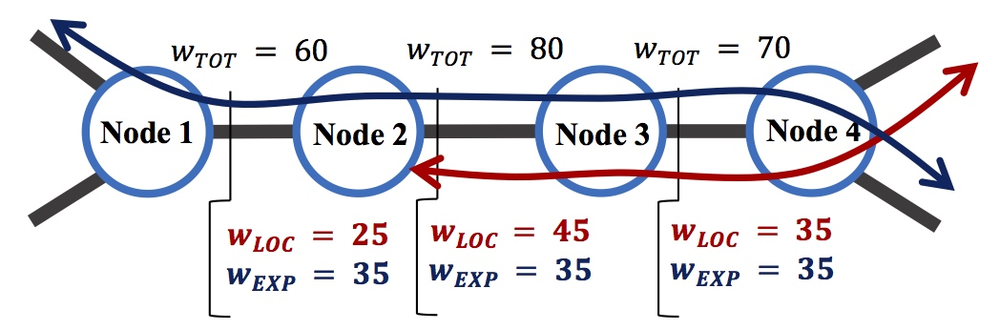
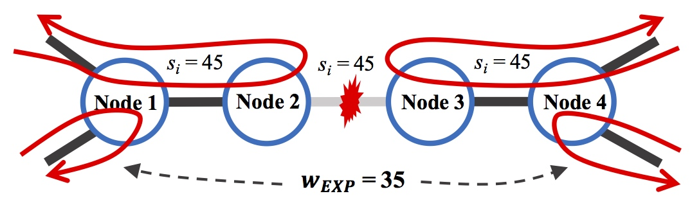
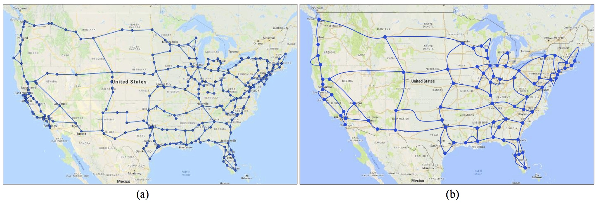
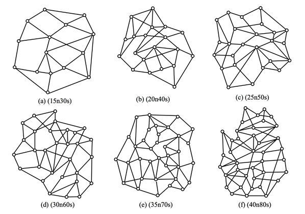

# MM-DFMR
The meta-mesh dual failure maximum restorability (MM-DFMR) ILP design model seek to maximize the dual-failure restorability by minimizing the number of non-restore working capacity allocated in the network desing. 

## The Meta-Mesh Design
The meta-mesh approach is a form of the conventional span restoration technique that takes advantage of the existence of chains of degree-2 nodes in the network allowing a reduction in spare capacity requirements. Consider the chain of degree-2 nodes shown in Figure 1, with working and spare capacities indicated by the wi and si. Using span restoration to provide the restorability of the spans in that chain will require at least as much spare capacity on each span within the chain as the maximum working capacity value allocated within the chain (except for the span with the maximum working capacity that will need spare capacity equal to the second highest working capacity in the chain). This is due to the fact that all working capacity on a span within the chain must be restored back through all surviving spans in the chain to the anchor nodes (the degree-3 nodes on the ends of the chain), and then back to the network.

  

However, a closer look at the nature of the working capacity on the spans in the chain will reveal something that it is shown in Figure 2. Only some of the working capacities on the spans within the chain will arise from working traffic that originates and/or terminates at one of the chains within the span; we call this local working flow, denoted by wLOC. The remainder of the working capacity on the chain’s spans arises from working traffic that fully transits the chain, originating and terminating elsewhere within the greater network; we call this express working flow, denoted by wEXP.

## The Meta-Mesh Design
The meta-mesh approach takes advantage of this breakdown with the realization that it is only the capacity arising from the local flow that needs to be restored by looping back all the way through the interior of the chain. The capacity that arises from express flow, on the other hand, can be allowed to fail all the way back to the anchor nodes in much the same way as stub-release in path restoration. As a result, the spans within the chain only require sufficient spare capacity to restore local flow capacity, as illustrated in Figure 3, where only 45 units of spare capacity would be needed within the chain to achieve full single failure restorability. This capacity is equal to the largest amount of working flow across the chain and, therefore, the chain spans now require 35 fewer units of spare capacity investment than needed previously (in Figure 1). Those fewer 35 units are now the express working flow.

  

  

This can be effectively accomplished by introducing a new logical bypass span between the anchor nodes of the chain and route express flow lightpaths onto this logical bypass span. The bypass span’s physical route would be identical to the chain’s constituent spans and would share a common cause of failure with each of those spans. When one of the chain’s spans fails, so too does the bypass span, thereby requiring restoration of the local flow working capacity on the failed span and the express flow working capacity on the bypass span. From the perspective of the traffic that fully transits chains, no chains exist (and as a consequence, neither do the degree-2 nodes within them), replaced by their associated bypass spans, so the effective connectivity of the network becomes much higher. This so-called meta-mesh of network topology, where each chain is replaced by a bypass span connecting its end nodes, is a homeomorphism of the original network topology. Such a meta-mesh topology is illustrated in Figure 4b, which derived from the original network topology shown in Figure 4a. At this level of abstraction, only the degree-3+ nodes from the original network exist, with all chains of degree-2 nodes replaced by bypass spans. The result is a network with much fewer spans and nodes, but most importantly, one with a significantly higher average nodal degree. A simple application of the 1⁄((d ̅-1) ) lower bound on redundancy suggests that the potential of efficiency of the network increases substantially. The lower bound of spare capacity redundancy of the original network in Figure 1 is 73%, while the lower bound of the meta-mesh network in Figure 5 is 45%.

  

## Experimental Networks
We base our experiments in a set of 124 test-case network topologies.

  

